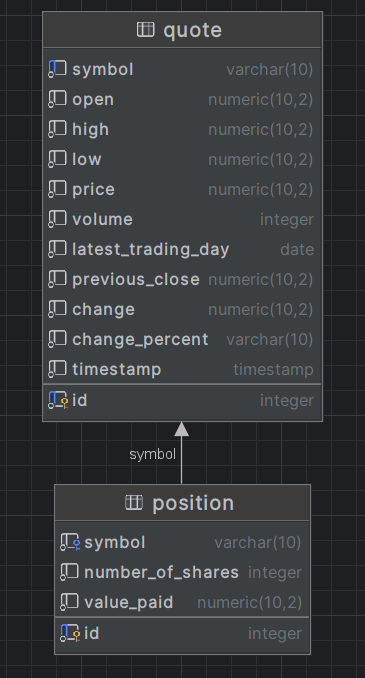

# Introduction
This application serves as a trading platform for buying and selling assets. It is built using Java and relies on JDBC for database connectivity. The data is stored in a PostgreSQL (PSQL) database, and Maven (MVN) is used for managing the project's build and dependencies. Users can perform buy and sell transactions through the platform, but it does not retain a history of sold positions, focusing solely on trading functionality.

# Implementaiton
## ER Diagram
  
In the diagram, it's evident that multiple positions are associated with each quote, and the Position table employs the symbol as a foreign key to establish this relationship.

## Design Patterns
In the context of the Stockquote application, we made a deliberate choice to employ the Data Access Object (DAO) pattern for managing our data access layer. While an alternative approach could have been to implement a repository pattern, we found that the inherent simplicity of our DAO objects and our adherence to the Data Transfer Object (DTO) design pattern favored a more direct and streamlined approach.

The DAO pattern, in its essence, simplifies the interaction between our application and the underlying database. It allows us to encapsulate the database-specific operations within dedicated DAO classes, making our code cleaner and more maintainable. These DAOs serve as intermediaries that abstract the database complexities, providing a clear and consistent interface for the application to work with.

The introduction of a repository pattern could have added an additional layer of abstraction, but in our case, it didn't offer substantial advantages. Since our DAO objects are inherently straightforward and the data transfer between our application and the database is efficiently handled through DTOs, we opted for the simplicity of keeping everything within a single DAO layer.

This approach allows us to have our database-related logic and queries in close proximity, making it easier to manage and maintain. While it might not follow a traditional repository pattern, it aligns with the principle of simplicity and pragmatism in our specific context.

# Test
In JUnit testing, we set up a test database environment, load specific test data, and create test cases to validate database interactions. We utilize JUnit's assertions to check if query results match expected outcomes. Isolation is maintained to prevent interference between tests. Upon test completion, the database is cleaned up to its initial state. This approach ensures that our database interactions are tested thoroughly, enhancing the reliability of our application.