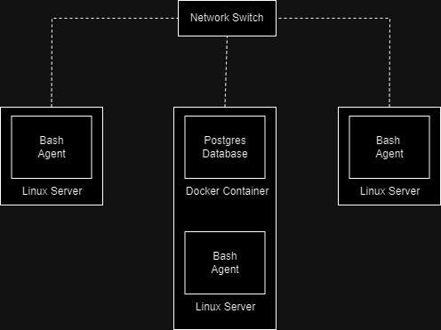

# Linux Cluster Monitoring Agent

## Introduction
The Linux Cluster Monitoring Agent has been crafted with the purpose of real-time server resource monitoring, including CPU, memory, and disk usage. This agent can be deployed on every node within the cluster, where it diligently records hardware specifications and resource utilization, storing this valuable data in a database. Cluster administration teams can leverage this data for future resource planning endeavors. This solution has been meticulously developed using a combination of bash scripting, Docker, PostgreSQL, and Git.

## Quick Start
- Start a psql instance using psql_docker.sh
```
# use this script with create command to create a psql instance with your own password an username
bash scripts/psql_docker.sh create [username] [password]
```
- Create tables using ddl.sql
```
#connect to the psql instance
psql -h localhost -U postgres -W

#create a database (host_agent is the required name)
postgres=# CREATE DATABASE host_agent;

#connect to the new database;
postgres=# \c host_agent;
    
#use this command to create the needed tables
psql -h localhost -U postgres -d host_agent -f sql/ddl.sql
```
- Insert hardware specs data into the DB using host_info.sh
```
bash scripts/host_info.sh localhost 5432 host_agent [psql_user] [psql_password]
```
- Insert hardware usage data into the DB using host_usage.sh
``` 
bash scripts/host_usage.sh localhost 5432 host_agent [psql_user] [psql_password]
```
- Crontab setup
```
# Edit crontab jobs
crontab -e
  
# Press i key to insert text, then escape once you have finished inserting the line of text bellow press escape to stop insertion then shift + z twice to exit
* * * * * bash /home/centos/dev/jarvis_data_eng_[name]/linux_sql/scripts/host_usage.sh localhost 5432 host_agent postgres password > /tmp/host_usage.log
  
# Check that the crontab is running
crontab -l
```
# Implementation
The monitoring agent is constructed using a pair of bash scripts, specifically host_info.sh and host_usage.sh, which handle the collection and storage of data. Every node within the cluster accommodates a monitoring agent, which contributes its data to a PostgreSQL database. This database is managed within a Docker container situated on one of the cluster nodes, with data persistence ensured by creating a Docker volume. host_info.sh focuses on recording hardware specifications, operating as a one-time task under the assumption of static hardware data. Conversely, host_usage.sh continuously records resource utilization data and requires execution every minute, orchestrated by the crontab bash job scheduler.

## Architecture
<p>
  
</p>

## Scripts
- psql_docker.sh
This script provisions a PostgreSQL instance by utilizing a Docker container and offers the capability to initiate or halt the container. When using the "create" function, it's essential to provide both [username] and [password] as mandatory requirements. However, these fields are not needed for stop or start commands.
```
bash scripts/psql_docker.sh create|start|stop [username] [password]
```
- host_info.sh
This script collects hardware specifications and inserts into the database.
```
bash scripts/host_info.sh [psql_host] [psql_port] [db_name] [psql_user] [psql_password]
```
- host_usage.sh
Collects resource usage data and inserts into the database.
``` 
bash scripts/host_usage.sh [psql_host] [psql_port] [db_name] [psql_user] [psql_password]
```
- crontab 
Bash job scheduler for recording the resource usage data every minute or any other interval if changed.
```
* * * * * bash [project_path]/scripts/host_usage.sh psql_host psql_port db_name psql_user psql_password > /tmp/host_usage.log
```
- queries.sql 
it contains queries to complete the fallowing requirements:
  - Displays memory size of each host.
  - Displays average memory usage over 5 min intervals for each host.
  - Detects host failure by checking if there are 5 new entries in a 5 min interval.

## Database Modeling
`host_info`: Table containing Hardware Specification

| Column Name      | Data Type    | Constraints           | Description              |
|------------------|--------------|-----------------------|--------------------------|
| id               | SERIAL       | PRIMARY KEY, NOT NULL | Unique host ID number    |
| hostname         | VARCHAR      | UNIQUE, NOT NULL      | Fully qualified hostname |
| cpu_number       | SMALLINT     | NOT NULL              | Number of CPUs           |
| cpu_architecture | VARCHAR      | NOT NULL              | CPU architecture         |
| cpu_model        | VARCHAR      | NOT NULL              | CPU model                |
| cpu_mhz          | NUMERIC(9,3) | NOT NULL              | CPU speed in MHz         |
| l2_cache         | INTEGER      | NOT NULL              | L2 cache in kB           |
| total_mem        | INTEGER      | NOT NULL              | Total memory in kB       |
| timestamp        | TIMESTAMP    | NOT NULL              | Timestamp in UTC         |

`host_usage`: Table containing Resource Usage

| Column Name    | Data Type | Constraints           | Description             |
|----------------|-----------|-----------------------|-------------------------|
| timestamp      | TIMESTAMP | PRIMARY KEY, NOT NULL | Timestamp in UTC        |
| host_id        | SERIAL    | FOREIGN KEY, NOT NULL | Unique host ID number   |
| memory_free    | INTEGER   | NOT NULL              | Free memory in MB       |
| cpu_idle       | SMALLINT  | NOT NULL              | CPU idle in %           |
| cpu_kernel     | SMALLINT  | NOT NULL              | CPU used by kernel in % |
| disk_io        | INTEGER   | NOT NULL              | Number of disk I/O      |
| disk_available | INTEGER   | NOT NULL              | Disk available in MB    |

## Test
This application has been manually tested with each command being checked to see if the required result was produced.

## Deployment
GitHub manages source code, the agent is scheduled using `cron,` and the PostgreSQL database is provisioned with Docker.

## Improvements
- Currently, host_info is only ever to be run once, and this should change so that if there is ever a system change, it can change the information in the database accordingly.
- Remove old data if it is no longer relevant, like in the case of a hardware update.
- Have a single script that can call on all the other scripts and set up everything when called.